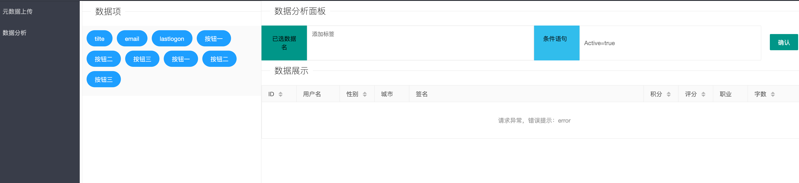
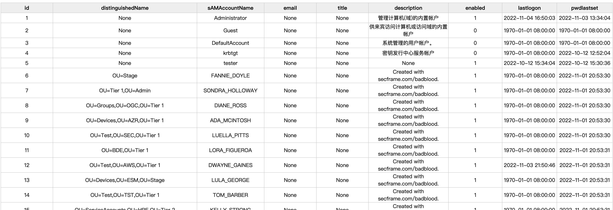

# ADExplorerX

>一款用于处理`ADExplorerSnapshot.py`生成的`Objects`数据，方便快速分析导出域内数据，在上传DNS数据和登录日志后能快速定位机器。

理想未完成WEB界面



经过简单的几行代码组装实现了临时命令行版本（~~能用就行版本~~）


```
USE:

╭─Ye@MacBook-Pro ~/Documents/Ldap 
╰─$ python3 run.py                                                      
usage: run.py [-h] [-g] [-p] [-u] noJson
run.py: error: the following arguments are required: noJson
╭─Ye@MacBook-Pro ~/Documents/Ldap 
╰─$ python3 run.py DC1.test.local_1667736177_objects.ndjson  -u > 1.html 
```




# 参考

[ADExplorerSnapshot.py](https://github.com/c3c/ADExplorerSnapshot.py/)

[ldapsearch-ad](https://github.com/yaap7/ldapsearch-ad)

[BloodHound.py](https://github.com/fox-it/BloodHound.py)